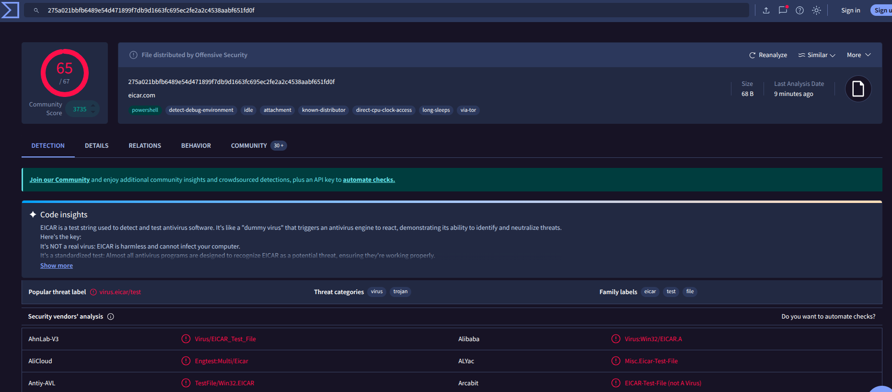
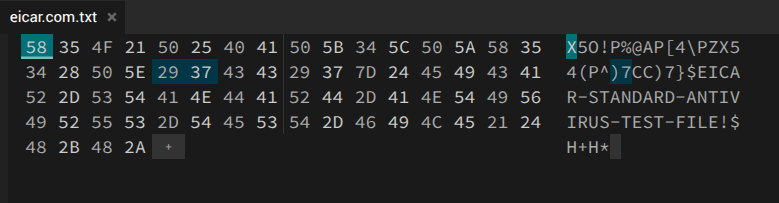
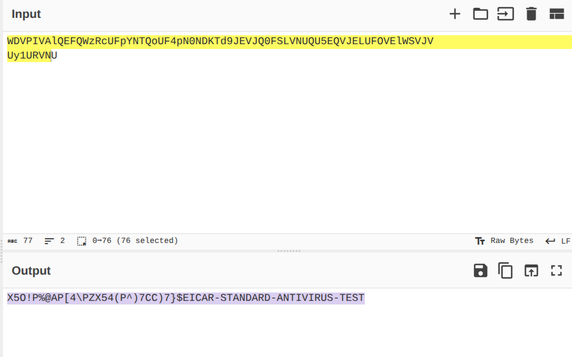

**name : Gaurang Tyagi**

**roll no. : 16**# Static Malware Analysis

## Part A : Practical Implementation

> sha256 hash of the file

```
275a021bbfb6489e54d471899f7db9d1663fc695ec2fe2a2c4538aabf651fd0f  eicar.com.txt
```

> virustotal analysis



    The above image shows the number of engines that have flagged this file and three named detections

> hexed.it result



    The above image showing the raw bytes in the middle column and the ascii representation in the right most column

```
readable string in the output : 

EICAR-STANDARD-ANTIVIRUS-TEST-FILE
```

> cyberchef result

```
X5O!P%@AP[4\PZX54(P^)7CC)7}$EICAR-STANDARD-ANTIVIRUS-TEST
```



    The above screenshot shows the input and the output of From Base64 operation

## Part B : Indian Cyber Law & Compliance

> **scenario**

```
Helios Financial Services, a mid-sized fintech firm operating across Mumbai and Bengaluru, has
reported that several employees received a suspicious email attachment claiming to be an invoice. The Security
Operations Centre (SOC) has quarantined a copy of the file and tasked you, the junior analyst, with performing
initial static analysis. Your objective is to identify whether the file is malicious, extract any Indicators of
Compromise (IOCs), and recommend next steps. For this exercise, you will use the EICAR test file as a stand-in
for the suspicious attachment.
```

> **Company Liability:** Under Section 43A of the IT Act, 2000, can Helios Financial Services be legally
> penalised for failing to protect customer financial information that was leaked as a result of the malware
> infection? Explain the conditions under which liability is established.	

<p>
Under <a href="https://www.indiacode.nic.in/show-data?actid=AC_CEN_45_76_00001_200021_1517807324077&orderno=49">Information Technology Act, 2000, Section 43A </a> provides that a body corporate handling sensitive personal data is liable to pay compensation if it is negligent in implementing reasonable security practices and such negligence results in wrongful loss or gain.

In the given scenario, Helios Financial Services, being a fintech company, processes sensitive financial and personal data of customers. Therefore, it falls within the scope of Section 43A.

Liability will be established only if the following conditions are satisfied:

 - Handling of Sensitive Personal Data:
Helios processes customer financial information, which qualifies as sensitive personal data.

 - Failure to Implement Reasonable Security Practices:
The company must demonstrate that it followed standard security measures such as secure email filtering, endpoint protection, employee awareness training, and recognized standards like ISO/IEC 27001.
If employees were able to execute a malicious attachment due to lack of such controls, it indicates failure of reasonable security practices.

 - Negligence:
The absence of adequate safeguards (e.g., phishing protection, incident response mechanisms) may amount to negligence.

 - Resulting Damage or Loss:
Compensation under Section 43A arises only if the breach leads to actual loss, such as leakage of customer financial data.

If all these elements are proven, Helios can be held liable to pay damages to affected customers.

</p>

> **Mandatory Reporting:** According to the CERT-In Directions of April 2022, what are the exact steps and
the maximum permitted timeframe within which Helios must report this cyber incident to the government
authorities?

<p>
As per <a href="https://www.cert-in.org.in/PDF/CERT-In_Directions_70B_28.04.2022.pdf">CERT-In Directions 2022 </a>, all service providers, intermediaries, data centres, and body corporates are required to report specified cybersecurity incidents to CERT-In within a prescribed timeframe.

In the given scenario, the malicious email attachment leading to a potential malware infection qualifies as a reportable cybersecurity incident.

The organization must report the incident to CERT-In within 6 hours of the occurrence of the incident or the time it comes to the organization’s knowledge.

- Steps for Mandatory Reporting:

1. Helios must first confirm that the event (phishing email with malware attachment) falls under reportable incidents such as malware attacks or unauthorized access.
2. The company must promptly report the incident using CERT-In’s prescribed channels (such as email or official reporting formats), including nature and description of the incident, date and time of occurrence/detection,systems and networks affected and initial impact assessment
3. Helios is required to maintain and preserve relevant system logs for a period of 180 days to aid in investigation and forensic analysis.
4. The organization must provide additional information or assistance as requested by CERT-In during investigation and response.
5. Steps such as isolating infected systems, preventing further spread, and initiating internal incident response must be undertaken.
</p>

## Part C : Questions

> Why is computing a cryptographic hash (such as SHA256) one of the very first steps in static malware
analysis? What are the limitations of relying on hash-based detection alone, and how can attackers easily
bypass it?

```
A cryptographic hash such as SHA-256 is computed at the start of static malware analysis because it provides a unique fingerprint of a file.

- Limitation

Even a single-byte changes it gives completely different hash,
Hash doesn’t tell what the malware does,
It cannot detect variants of the same malware,

- Attackers can bypass it by : 
Changing the file structure,
Generate new variants with different hashes by making small changes to the metadata,
Adding junk bytes or reordering code
```

> Differentiate between static and dynamic malware analysis. Give one realistic scenario where static
analysis alone would be insufficient and explain what dynamic analysis would reveal in that situation.

| Static Malware Analysis | Dynamic Malware Analysis |
|------|------|
| Examines malware file without executing it | Executes malware in a controlled sandbox environment |
| Includes strings, headers, imports, hashes | Observes system changes, network activity and file/registry modifications |

```
Scenario where static analysis fails ->

A packed ransomware sample:

Static analysis shows only encrypted/obfuscated code and no readable strings or meaningful imports whereas dynamic analysis exposes actual behavior, which static analysis may hide and reveals file encryption behaviour and communication with command-and-control servers
```

> What are Indicators of Compromise (IOCs) and why are they central to a SOC analyst's workflow? Give
at least four distinct types of IOCs and provide one example of each.

```
IOCs are forensic artifacts that indicate a system may be compromised.IOCs enable quick detection but must be updated frequently as attackers evolve.

They help detect, investigate, and respond to threats and are used in SIEM rules, threat hunting, and incident response.

There are different types of IOCs
1. File-based IOC: example - SHA-256 hash of malware
2. Network-based IOC: example - Malicious IP (e.g., 192.168.x.x)
3. Domain Host-based IOC: example - Suspicious registry key or system file modification
4. Behavioral IOC: example - Process injecting code into another process

```

> Explain the concepts of obfuscation and packing in the context of malware. Why do attackers use these
techniques, and what tools or signs would help an analyst detect that a binary has been packed?

```
Obfuscation is the technique to hide or make code difficult to understand for e.g.,renaming variables,encrypting strings
Packing is the process of compressesing/encrypting executable using tools like UPX. It unpacks itself during execution time.Analysts often need to unpack malware before proper analysis.

Attackers use them to evade antivirus detection,prevent reverse engineering and delay analysis
Signs of packaging includes high entropy i.e, random-looking data,few readable strings and small import table i.e, small number of dependencies.

Some tools for packaging are : 

1. PEiD (packer detection)
2. Strings utility
3. Entropy analysis tools

```

> Imagine you are the SOC analyst for Helios Financial Services and your static analysis has confirmed that
the suspicious attachment is malicious. Outline the immediate next three steps you would take, in order,
and justify why each step is important.

```
Steps that I would take if I was an SOC analyst for Helios Financial Services : 
1. Isolate the affected system -Disconnect it from the network and prevent lateral movement.This stops spread of malware across organization


2. Collect and preserve evidence - Capture logs, memory dumps and infected files. This is crucial for forensic investigation and legal compliance

3. Initiate containment & remediation - Try removing malware,patch vulnerabilities and reset credentials.This ensures system recovery and prevents reinfection
```