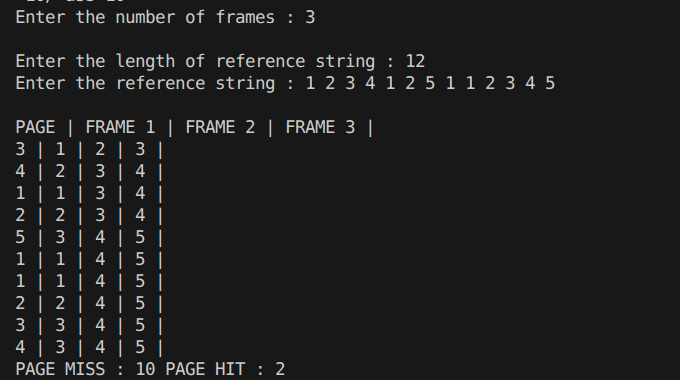

**Name : Gaurang Tyagi**
**Roll No. : 16**

# Assignment 10

## Ques. Write a C++ program to simulate the FIFO page replacement algorithm. The program should take the number of frames and a reference string (sequence of page requests) as input and determine the number of page faults that occur during execution.

### CODE : 

```cpp
#include <iostream>
#include <sstream>
#include <vector>
#include <set>
#include <queue>

struct PageReplacementResult
{
    size_t pageHit = 0;
    size_t pageMiss = 0;
};
void displayFrames(const std::set<size_t> frame, const size_t &page)
{
    std::cout << page << " | ";
    for (const size_t &f : frame)
    {
        std::cout << f << " | ";
    }
    std::cout << std::endl;
}
PageReplacementResult FIFO(const std::vector<size_t> &reference, const size_t &frameNums)
{
    PageReplacementResult res;
    std::queue<size_t> aux;
    std::set<size_t> frame;

    for (size_t f = 0; f < frameNums; f++)
    {
        frame.insert(reference[f]);
        aux.push(f);
        res.pageMiss++;
    }
    std::cout << "PAGE | FRAME 1 | FRAME 2 | FRAME 3 |" << std::endl;
    displayFrames(frame, reference[frameNums - 1]);
    for (size_t iter = frameNums; iter < reference.size(); iter++)
    {
        if (frame.count(reference[iter]))
        {
            res.pageHit++;
        }
        else
        {
            frame.erase(frame.cbegin());
            frame.insert(reference[iter]);
            res.pageMiss++;
        }
        displayFrames(frame, reference[iter]);
    }

    return res;
}
std::vector<size_t> getRefrenceString()
{
    size_t referenceLength = 0;
    std::cout << "Enter the length of reference string : ";
    std::cin >> referenceLength;

    std::vector<size_t> reference(referenceLength, 0);

    std::string referenceString;
    std::cout << "Enter the reference string : ";
    std::cin.ignore();
    std::getline(std::cin, referenceString);

    std::stringstream referenceStream(referenceString);
    for (size_t iter = 0; iter < referenceLength; iter++)
    {
        referenceStream >> reference[iter];
    }
    return reference;
}

int main()
{
    size_t frameNums;

    std::cout << "Enter the number of frames : ";
    std::cin >> frameNums;
    std::cout << std::endl;

    std::vector<size_t> reference = getRefrenceString();

    std::cout << std::endl;

    PageReplacementResult res = FIFO(reference, frameNums);
    std::cout << "PAGE MISS : " << res.pageMiss << " PAGE HIT : " << res.pageHit << std::endl;
    return 0;
}
```

### OUTPUT

