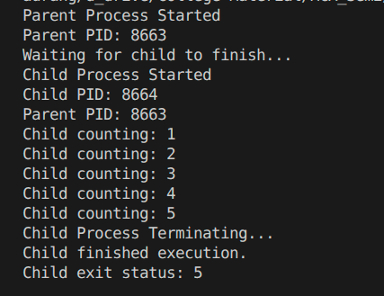

# Assignment-2
<br>
<br>
<br>

## Ques2. Write a C++ program to demonstrate process creation using fork(). The child process should print its PID and parent PID, perform a simple task (e.g., counting from 1 to 5 with delay), and then terminate. The parent process should wait for the child using wait() and display the child’s exit status.

```cpp
#include <iostream>
#include <unistd.h>
#include <sys/wait.h>
#include <cstdlib>

using namespace std;

int main() {
    int pid;
    int status;

    pid = fork();

    if (pid < 0) {
        cerr << "Fork failed!" << endl;
        return 1;
    }

    else if (pid == 0) {
        cout << "Child Process Started" << endl;
        cout << "Child PID: " << getpid() << endl;
        cout << "Parent PID: " << getppid() << endl;

        for (int i = 1; i <= 5; i++) {
            cout << "Child counting: " << i << endl;
            sleep(1);
        }

        cout << "Child Process Terminating..." << endl;

        exit(5);
    }

    else {
        cout << "Parent Process Started" << endl;
        cout << "Parent PID: " << getpid() << endl;
        cout << "Waiting for child to finish..." << endl;

        wait(&status);
        cout << "Child finished execution." << endl;

        
        if (WIFEXITED(status)) {
            cout << "Child exit status: " << WEXITSTATUS(status) << endl;
        } else {
            cout << "Child did not terminate normally." << endl;
        }
    }

    return 0;
}

```

- ## OUTPUT
