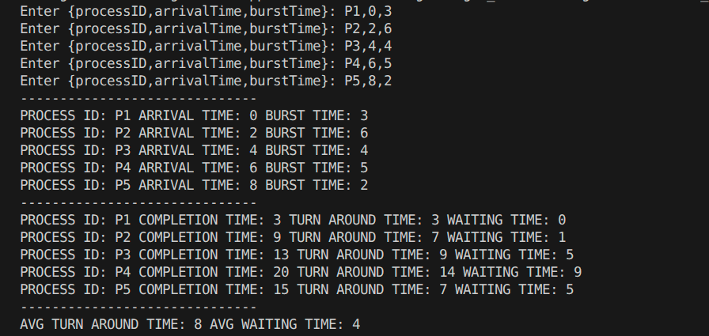

# Assignment 5

## Q1. HRRN (Highest Response Ratio Next ) Write a C/C++ program that:
    1. Reads the number of processes (Sample input)
    2. Accepts arrival time and burst time for each process (Sample input)
    3. Schedules processes using HRRN 
    4. Calculates WT and TAT
    5. Displays results in tabular form
    6. Calculate and display Average WT and TAT

## CODE
```cpp
#include <iostream>
#include <vector>
#include <sstream>
#include <algorithm>
#include <queue>
#include <climits>

struct Times
{
    std::string processID;
    int arrivalTime = 0;
    int burstTime = 0;
};
struct Report
{
    std::string processId;
    int completionTime = 0;
    double turnAroundTime = 0;
    double waitingTime = 0;
};
struct burstTimeCompare
{
    bool operator()(const std::pair<size_t, Times> &p1, const std::pair<size_t, Times> &p2)
    {
        return p1.second.burstTime > p2.second.burstTime;
    }
};
class SchedulingAlgorithms
{
private:
    std::vector<Times> info;

public:
    SchedulingAlgorithms(const int &n)
    {
        info.resize(n);

        for (int i = 0; i < n; i++)
        {
            std::string row;
            std::cout << "Enter {processID,arrivalTime,burstTime}: ";
            std::cin >> row;

            std::stringstream rowStream(row);

            std::string value;

            std::getline(rowStream, value, ',');
            info[i].processID = value;

            std::getline(rowStream, value, ',');
            info[i].arrivalTime = stoi(value);

            std::getline(rowStream, value, ',');
            info[i].burstTime = stoi(value);
        }
    }
    std::pair<size_t, Times> findFirst(const std::pair<size_t, Times> &proc, int time)
    {
        for (int i = proc.first; i < info.size(); i++)
        {
            if (info[i].arrivalTime > time)
                return {i, info[i]};
        }
        return {-1, Times()};
    }
    size_t findLargestResponseRatio(const std::vector<int> &schedulerQueue, const int &time)
    {
        // for (auto iter : schedulerQueue)
        // {
        //     std::cout << iter << std::endl;
        // }
        // std::cout << std::endl;
        double maxResponseRatio = INT_MIN;
        size_t maxResponseRatioIndex = 0;
        for (int i = 0; i < schedulerQueue.size(); i++)
        {
            int waitingTime = time - info[schedulerQueue[i]].arrivalTime;
            double responseRatio = (double)(waitingTime + info[schedulerQueue[i]].burstTime) / info[schedulerQueue[i]].burstTime;
            // std::cout << schedulerQueue[i] << " " << responseRatio << std::endl;
            if (responseRatio > maxResponseRatio)
            {
                maxResponseRatio = responseRatio;
                maxResponseRatioIndex = schedulerQueue[i];
            }
        }
        return maxResponseRatioIndex;
    }
    Report calcAverage(const std::vector<Report> &rep)
    {
        Report report;
        double avgTurnAroundTime = 0;
        double avgWaitingTime = 0;
        for (const Report &r : rep)
        {
            avgTurnAroundTime += r.turnAroundTime;
            avgWaitingTime += r.waitingTime;
        }
        report.turnAroundTime = double(avgTurnAroundTime) / info.size();
        report.waitingTime = double(avgWaitingTime) / info.size();

        return report;
    }
    void fcfs()
    {
        std::sort(info.begin(), info.end(), [](const Times &p1, const Times &p2)
                  { return p1.arrivalTime < p2.arrivalTime; });
        std::vector<Report> rep(info.size());
        int completionTime = 0;
        for (int i = 0; i < info.size(); i++)
        {
            rep[i].processId = info[i].processID;
            completionTime += info[i].burstTime;

            rep[i].completionTime = completionTime;
            rep[i].turnAroundTime = rep[i].completionTime - info[i].arrivalTime;
            rep[i].waitingTime = rep[i].turnAroundTime - info[i].burstTime;
        }
        display();

        std::cout << "------------------------------" << std::endl;
        for (const Report &r : rep)
        {
            std::cout << "PROCESS ID: " << r.processId << " COMPLETION TIME: " << r.completionTime << " TURN AROUND TIME: " << r.turnAroundTime << " WAITING TIME: " << r.waitingTime << std::endl;
        }
        Report avg_report = calcAverage(rep);
        std::cout << "------------------------------\n";
        std::cout << "AVG TURN AROUND TIME: " << avg_report.turnAroundTime << " AVG WAITING TIME: " << avg_report.waitingTime << std::endl;
    }
    void sjf()
    {
        std::sort(info.begin(), info.end(), [](const Times &p1, const Times &p2)
                  { return p1.arrivalTime < p2.arrivalTime; });
        int infoSize = info.size();
        std::vector<Report> rep(infoSize);
        std::vector<bool> isComplete(infoSize, false);
        int time = info[0].arrivalTime;
        for (int i = 0; i < infoSize; i++)
        {
            size_t index = i;
            int minBurst = INT_MAX;
            for (int j = 0; j < infoSize; j++)
            {
                if (!isComplete[j] && info[j].arrivalTime <= time && info[j].burstTime < minBurst)
                {
                    index = j;
                }
            }
            rep[index].processId = info[index].processID;
            time += info[index].burstTime;
            rep[index].completionTime = time;
            rep[index].turnAroundTime = rep[index].completionTime - info[index].arrivalTime;
            rep[index].waitingTime = rep[index].turnAroundTime - info[index].burstTime;
            isComplete[index] = true;
        }

        display();
        std::cout << "------------------------------\n";
        for (const Report &r : rep)
        {
            std::cout << "PROCESS ID: " << r.processId << " COMPLETION TIME: " << r.completionTime << " TURN AROUND TIME: " << r.turnAroundTime << " WAITING TIME: " << r.waitingTime << std::endl;
        }
        Report avg_report = calcAverage(rep);
        std::cout << "------------------------------\n";
        std::cout << "AVG TURN AROUND TIME: " << avg_report.turnAroundTime << " AVG WAITING TIME: " << avg_report.waitingTime << std::endl;
    }
    void srjf()
    {
        const size_t &infoSize = info.size();
        std::sort(info.begin(), info.end(), [](const Times &p1, Times &p2)
                  { return p1.arrivalTime < p2.arrivalTime; });
        std::priority_queue<std::pair<size_t, Times>, std::vector<std::pair<size_t, Times>>, burstTimeCompare> schedulerQueue;
        std::vector<Report> rep(infoSize);
        std::vector<size_t> burstTimes(infoSize, 0);

        size_t time = info[0].arrivalTime;
        size_t iter = 0;
        while (time >= info[iter].arrivalTime && iter < infoSize)
        {
            schedulerQueue.push({iter, info[iter]});
            ++iter;
        }
        while (!schedulerQueue.empty())
        {
            std::pair<size_t, Times> proc = schedulerQueue.top();
            schedulerQueue.pop();

            std::pair<size_t, Times> nextProc = findFirst(proc, time);
            if (nextProc.first != -1)
            {
                int diff = nextProc.second.arrivalTime - proc.second.arrivalTime;
                if (proc.second.burstTime >= diff)
                {
                    time += diff;
                    burstTimes[proc.first] += diff;
                    proc.second.burstTime -= diff;
                }
                else
                {
                    time += proc.second.burstTime;
                    burstTimes[proc.first] += proc.second.burstTime;
                    proc.second.burstTime = 0;

                    rep[proc.first].processId = proc.second.processID;
                    rep[proc.first].completionTime = time;
                    rep[proc.first].turnAroundTime = rep[proc.first].completionTime - info[proc.first].arrivalTime;
                    rep[proc.first].waitingTime = rep[proc.first].turnAroundTime - burstTimes[proc.first];
                }
                if (proc.second.burstTime != 0)
                {
                    schedulerQueue.push({proc.first, proc.second});
                }
                else
                {
                    rep[proc.first].processId = proc.second.processID;
                    rep[proc.first].completionTime = time;
                    rep[proc.first].turnAroundTime = rep[proc.first].completionTime - info[proc.first].arrivalTime;
                    rep[proc.first].waitingTime = rep[proc.first].turnAroundTime - burstTimes[proc.first];
                }
            }
            else
            {
                time += proc.second.burstTime;
                burstTimes[proc.first] += proc.second.burstTime;
                proc.second.burstTime = 0;

                rep[proc.first].processId = proc.second.processID;
                rep[proc.first].completionTime = time;
                rep[proc.first].turnAroundTime = rep[proc.first].completionTime - info[proc.first].arrivalTime;
                rep[proc.first].waitingTime = rep[proc.first].turnAroundTime - burstTimes[proc.first];
            }
            while (time >= info[iter].arrivalTime && iter < infoSize)
            {
                schedulerQueue.push({iter, info[iter]});
                ++iter;
            }
        }

        display();
        std::cout << "------------------------------\n";
        for (const Report &r : rep)
        {
            std::cout << "PROCESS ID: " << r.processId << " COMPLETION TIME: " << r.completionTime << " TURN AROUND TIME: " << r.turnAroundTime << " WAITING TIME: " << r.waitingTime << std::endl;
        }
        Report avg_report = calcAverage(rep);
        std::cout << "------------------------------\n";
        std::cout << "AVG TURN AROUND TIME: " << avg_report.turnAroundTime << " AVG WAITING TIME: " << avg_report.waitingTime << std::endl;
    }
    void roundRobin(const size_t &quantum)
    {
        const size_t &infoSize = info.size();
        sort(info.begin(), info.end(), [](const Times &p1, const Times &p2)
             { return p1.arrivalTime < p2.arrivalTime; });
        std::vector<Report> rep(infoSize);
        std::vector<size_t> burstTimes(infoSize);
        std::vector<Times> infoCopy(info);
        size_t time = info[0].arrivalTime;

        std::queue<size_t> schedulerQueue;
        size_t iter = 0;
        while (iter < infoSize && info[iter].arrivalTime <= time)
        {
            schedulerQueue.push(iter);
            ++iter;
        }
        while (!schedulerQueue.empty())
        {
            const size_t &procIndex = schedulerQueue.front();
            schedulerQueue.pop();

            if (infoCopy[procIndex].burstTime >= quantum)
            {
                time += quantum;
                infoCopy[procIndex].burstTime -= quantum;
            }
            else
            {
                time += infoCopy[procIndex].burstTime;
                infoCopy[procIndex].burstTime = 0;
            }
            while (iter < infoSize && time >= info[iter].arrivalTime)
            {
                schedulerQueue.push(iter);
                ++iter;
            }
            if (infoCopy[procIndex].burstTime != 0)
            {
                schedulerQueue.push(procIndex);
            }
            else
            {
                rep[procIndex].processId = info[procIndex].processID;
                rep[procIndex].completionTime = time;
                rep[procIndex].turnAroundTime = rep[procIndex].completionTime - info[procIndex].arrivalTime;
                rep[procIndex].waitingTime = rep[procIndex].turnAroundTime - info[procIndex].burstTime;
            }
        }
        display();
        std::cout << "------------------------------\n";
        for (const Report &r : rep)
        {
            std::cout << "PROCESS ID: " << r.processId << " COMPLETION TIME: " << r.completionTime << " TURN AROUND TIME: " << r.turnAroundTime << " WAITING TIME: " << r.waitingTime << std::endl;
        }
        Report avg_report = calcAverage(rep);
        std::cout << "------------------------------\n";
        std::cout << "AVG TURN AROUND TIME: " << avg_report.turnAroundTime << " AVG WAITING TIME: " << avg_report.waitingTime << std::endl;
    }
    void HRRF()
    {
        std::sort(info.begin(), info.end(), [](const Times &p1, const Times &p2)
                  { return p1.arrivalTime < p2.arrivalTime; });
        std::vector<int> schedulerQueue;
        std::vector<Report> rep(info.size());
        int time = info[0].arrivalTime;
        int iter = 0;
        while (info[iter].arrivalTime <= time)
        {
            schedulerQueue.push_back(iter);
            ++iter;
        }
        while (!schedulerQueue.empty())
        {
            size_t maxResponseRatioIndex = findLargestResponseRatio(schedulerQueue, time);
            // std::cout << maxResponseRatioIndex << std::endl;
            time += info[maxResponseRatioIndex].burstTime;
            rep[maxResponseRatioIndex].processId = info[maxResponseRatioIndex].processID;
            rep[maxResponseRatioIndex].completionTime = time;
            rep[maxResponseRatioIndex].turnAroundTime = rep[maxResponseRatioIndex].completionTime - info[maxResponseRatioIndex].arrivalTime;
            rep[maxResponseRatioIndex].waitingTime = rep[maxResponseRatioIndex].turnAroundTime - info[maxResponseRatioIndex].burstTime;

            auto schedulerIter = std::find(schedulerQueue.begin(), schedulerQueue.end(), maxResponseRatioIndex);
            if (schedulerIter != schedulerQueue.end())
                schedulerQueue.erase(schedulerIter);

            while (info[iter].arrivalTime <= time)
            {
                schedulerQueue.push_back(iter);
                ++iter;
            }
        }
        display();
        std::cout << "------------------------------\n";
        for (const Report &r : rep)
        {
            std::cout << "PROCESS ID: " << r.processId << " COMPLETION TIME: " << r.completionTime << " TURN AROUND TIME: " << r.turnAroundTime << " WAITING TIME: " << r.waitingTime << std::endl;
        }
        Report avg_report = calcAverage(rep);
        std::cout << "------------------------------\n";
        std::cout << "AVG TURN AROUND TIME: " << avg_report.turnAroundTime << " AVG WAITING TIME: " << avg_report.waitingTime << std::endl;
    }
    void display() const
    {
        const size_t infoSize = info.size();
        std::cout << "------------------------------\n";
        for (int i = 0; i < infoSize; i++)
        {
            std::cout << "PROCESS ID: " << info[i].processID << " ARRIVAL TIME: " << info[i].arrivalTime << " BURST TIME: " << info[i].burstTime << std::endl;
        }
    }
};

int main()
{
    // int nProcesses = 0;
    // std::cout << "Enter the number of processes: ";
    // std::cin >> nProcesses;

    SchedulingAlgorithms scheduler(5);
    scheduler.HRRF();
    return 0;
}
```
## OUTPUT

