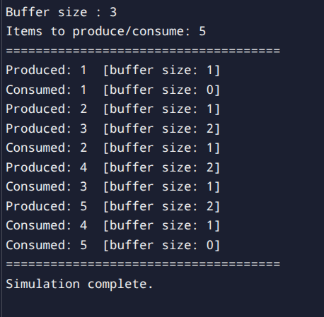

# Assignment 8

## Write a C++ program to simulate one Producer and one Consumer using a shared buffer of fixed size.

```Your program should satisfy the following requirements:

Create a buffer of size 3 (use array or queue). 

Use the following semaphores: 

mutex = 1 (for mutual exclusion) 

empty = 3 (buffer initially empty) 

full = 0 (no items initially) 

Create: 

1 Producer thread 

1 Consumer thread 

The Producer should: 

Produce numbers from 1 to 5 

Add them to the buffer 

Print:
"Produced: i" 

The Consumer should: 

Remove items from the buffer 

Print:
"Consumed: i" 

Use proper synchronization: 

Producer waits if buffer is full 

Consumer waits if buffer is empty 

Add small delay using sleep to observe output clearly 
```
## CODE

```cpp
#include <iostream>
#include <queue>
#include <thread>
#include <semaphore.h>
#include <unistd.h>

// ─── Shared Buffer ────────────────────────────────────────────────────────────
const int BUFFER_SIZE = 3;
std::queue<int> buffer;

// ─── Semaphores ───────────────────────────────────────────────────────────────
sem_t mutex;   // mutual exclusion  (initial value = 1)
sem_t empty;   // empty slots       (initial value = 3)
sem_t full;    // filled slots      (initial value = 0)

// ─── Producer Thread ──────────────────────────────────────────────────────────
void producer() {
    for (int i = 1; i <= 5; i++) {

        sem_wait(&empty);   // wait for an empty slot
        sem_wait(&mutex);   // enter critical section

        // ── Critical Section ──
        buffer.push(i);
        std::cout << "Produced: " << i
                  << "  [buffer size: " << buffer.size() << "]" << std::endl;
        // ── End Critical Section ──

        sem_post(&mutex);   // leave critical section
        sem_post(&full);    // signal one more filled slot

        sleep(1);           // small delay to observe output clearly
    }
}

// ─── Consumer Thread ──────────────────────────────────────────────────────────
void consumer() {
    for (int i = 1; i <= 5; i++) {

        sem_wait(&full);    // wait for a filled slot
        sem_wait(&mutex);   // enter critical section

        // ── Critical Section ──
        int item = buffer.front();
        buffer.pop();
        std::cout << "Consumed: " << item
                  << "  [buffer size: " << buffer.size() << "]" << std::endl;
        // ── End Critical Section ──

        sem_post(&mutex);   // leave critical section
        sem_post(&empty);   // signal one more empty slot

        sleep(2);           // consumer is slightly slower → shows blocking
    }
}

// ─── Main ─────────────────────────────────────────────────────────────────────
int main() {
    // Initialise semaphores
    sem_init(&mutex, 0, 1);            // mutual exclusion
    sem_init(&empty, 0, BUFFER_SIZE);  // all slots are empty at start
    sem_init(&full,  0, 0);            // no items in buffer at start

    std::cout << "=== Producer-Consumer Simulation ===" << std::endl;
    std::cout << "Buffer size : " << BUFFER_SIZE << std::endl;
    std::cout << "Items to produce/consume: 5" << std::endl;
    std::cout << "=====================================" << std::endl;

    // Create threads
    std::thread producerThread(producer);
    std::thread consumerThread(consumer);

    // Wait for both threads to finish
    producerThread.join();
    consumerThread.join();

    // Destroy semaphores
    sem_destroy(&mutex);
    sem_destroy(&empty);
    sem_destroy(&full);

    std::cout << "=====================================" << std::endl;
    std::cout << "Simulation complete." << std::endl;
    return 0;
}
```

# OUTPUT
