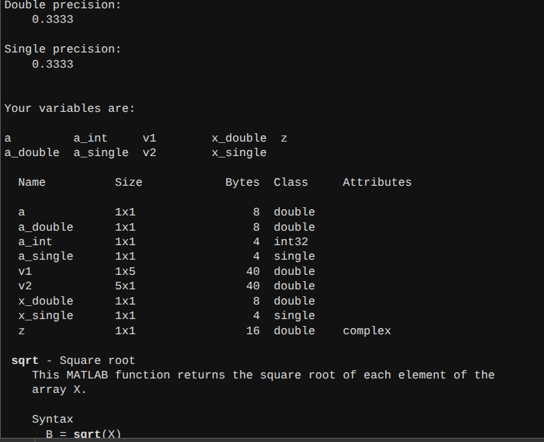
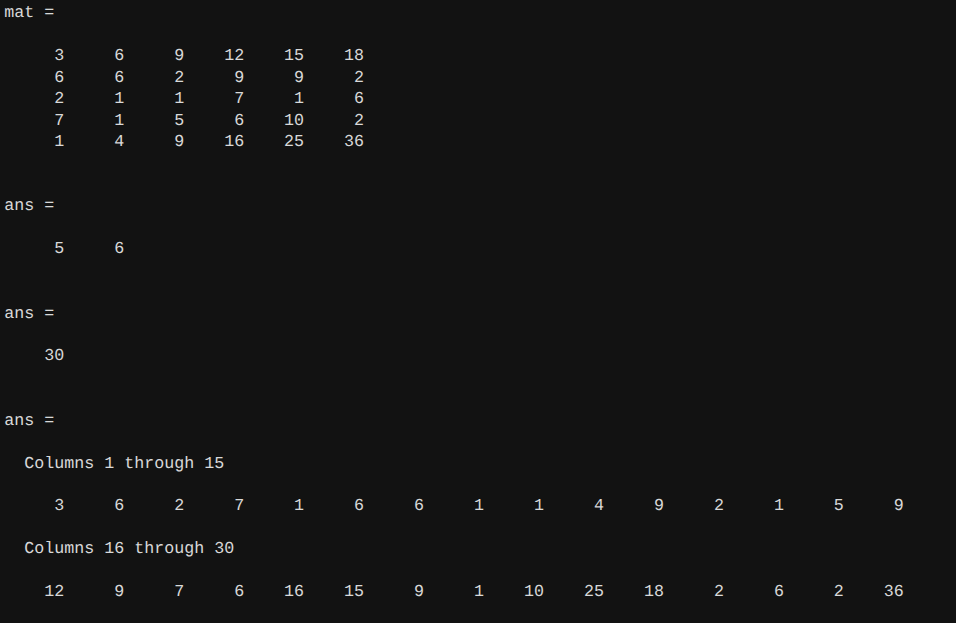
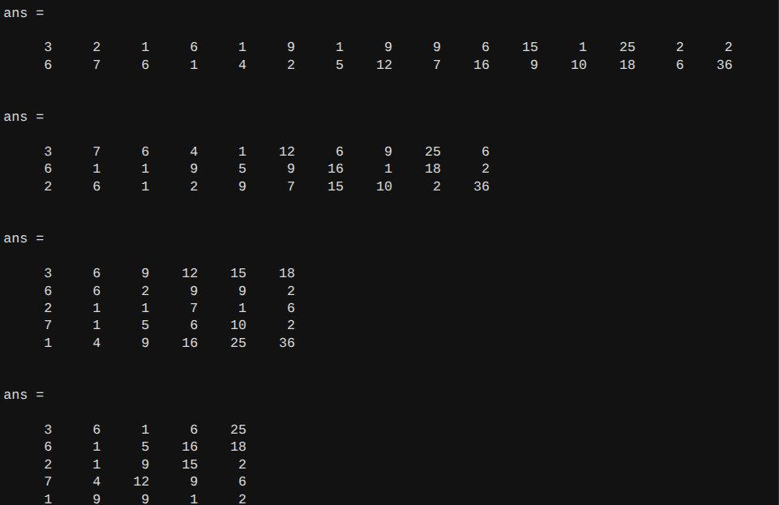
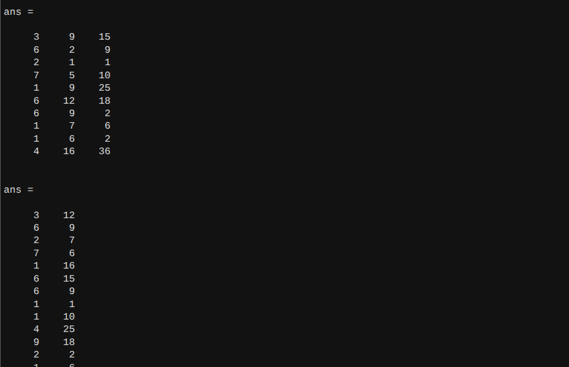
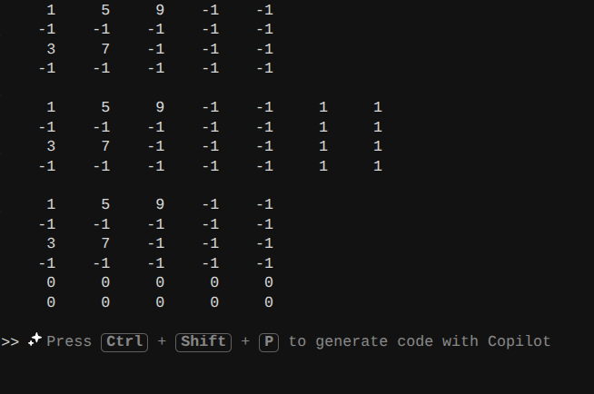
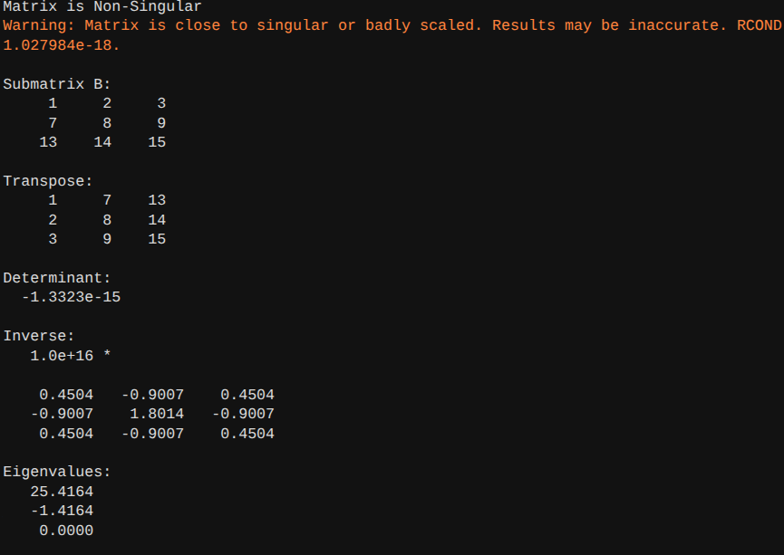
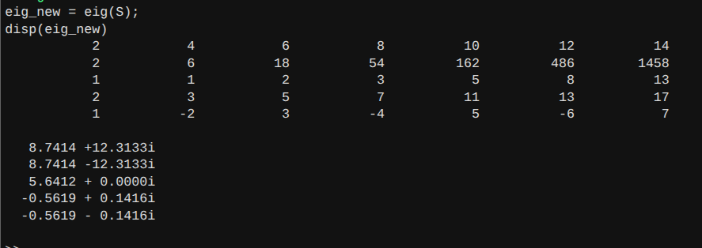

**Name : Gaurang Tyagi** 
<br>
**Roll No. : 16**

---

# Assignment - 7

## Ques1. Use MATLAB interface commands such as clc, clear, who, whos, and help, and create variables including a scalar, vectors, and a complex number, performing type conversion (double, single, int32) and comparing precision.

### CODE
```matlab
clc
clear

% Scalar
a = 10;

% Row vector
v1 = [1 2 3 4 5];

% Column vector
v2 = [1;2;3;4;5];

% Complex number
z = 3 + 4i;

% Type conversion
a_double = double(a);
a_single = single(a);
a_int = int32(a);

% Precision comparison
x_double = double(1/3);
x_single = single(1/3);

disp('Double precision:')
disp(x_double)

disp('Single precision:')
disp(x_single)

% Workspace info
who
whos

% Help command
help sqrt
```

### OUTPUT


## Ques 2. Construct a 5×6 matrix A with defined patterns (first row as multiples of 3, last row as squares, remaining rows as random integers), and reshape it into different valid dimensions while preserving the total number of elements.

### CODE
```matlab
first_row = 3*(1:6);
middle_rows = randi(10,3,6);
last_row = (1:6).^2;

mat = [first_row;middle_rows;last_row];
display(mat);

% dimensions
size(mat);
display(ans);

% number of elements

numel(mat);
display(ans);

% reshaping

reshape(mat,1,30);
display(ans);

reshape(mat,2,15);
display(ans);

reshape(mat,3,10);
display(ans);

reshape(mat,5,6);
display(ans);

reshape(mat,6,5);
display(ans);

reshape(mat,10,3);
display(ans);

reshape(mat,15,2);
display(ans);

reshape(mat,30,1);
display(ans);
```

### OUTPUT




## Ques 3. Apply advanced indexing and slicing techniques to extract submatrices, select specific rows/columns, and modify elements using logical conditions; also perform horizontal and vertical concatenation with another compatible matrix.

### CODE
```matlab
clc
clear

A = reshape(1:20,4,5);

% Submatrix
subA = A(2:3,2:4);

% Select rows
rows = A([1 3],:);

% Select columns
cols = A(:,[2 5]);

% Logical indexing
A(A>10) = 0;

% Even numbers modification
A(mod(A,2)==0) = -1;

% Horizontal concatenation
B = ones(4,2);
H = [A B];

% Vertical concatenation
C = zeros(2,5);
V = [A; C];

disp(A)
disp(H)
disp(V)
```
### OUTPUT


## Ques4. Extract a square submatrix from A and perform matrix operations including transpose, determinant, inverse (if it exists), and eigenvalue computation, and determine whether the matrix is singular or non-singular.

### CODE
```matlab
A = reshape(1:24, 6, 4)';
B = A(1:3, 1:3);
B_T = B';
detB = det(B);

if detB == 0
    disp('Matrix is Singular');
else
    disp('Matrix is Non-Singular');
end

if detB ~= 0
    B_inv = inv(B);
else
    disp('Inverse does not exist');
end

eigB = eig(B);

disp('Submatrix B:');
disp(B);

disp('Transpose:');
disp(B_T);

disp('Determinant:');
disp(detB);

disp('Inverse:');
disp(B_inv);

disp('Eigenvalues:');
disp(eigB);


```
### OUTPUT


## Ques 5. Create a new 5×7 matrix with distinct row-wise patterns (arithmetic progression, geometric progression, Fibonacci sequence, prime numbers, alternating signs), reshape it if possible into a square matrix, compute eigenvalues, and compare them with those obtained earlier.

### CODE
```matlab
% Arithmetic progression
r1 = 2:2:14;

% Geometric progression
r2 = 2 * 3.^(0:6);

% Fibonacci
r3 = zeros(1,7);
r3(1:2) = [1 1];
for i=3:7
    r3(i) = r3(i-1)+r3(i-2);
end

% Prime numbers
r4 = primes(20);
r4 = r4(1:7);

% Alternating signs
r5 = (-1).^(0:6).*(1:7);

% Matrix
M = [r1;r2;r3;r4;r5];

disp(M)

% reshape attempt
if mod(sqrt(numel(M)),1)==0
    S = reshape(M,sqrt(numel(M)),sqrt(numel(M)));
else
    S = reshape(M(1:25),5,5);
end

% eigenvalues
eig_new = eig(S);
disp(eig_new)
```

### OUTPUT
